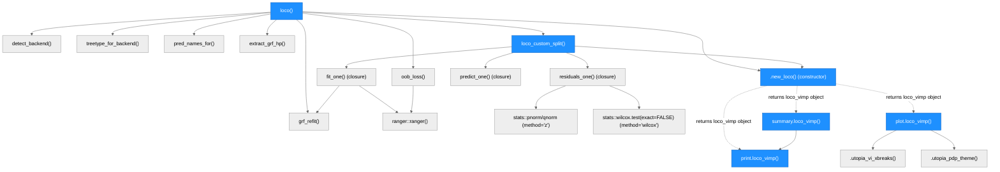
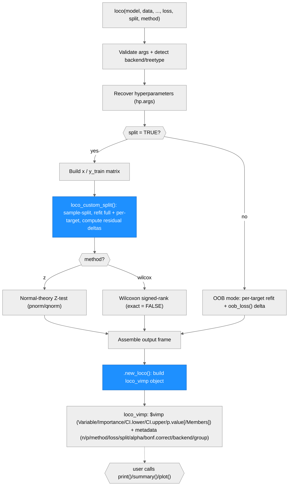

# Architecture — UtopiaPlanitia

> Generated by scriber for run `2026-07-06-loco-drop-conformal` on 2026-07-06.
> Updated by scriber for run `2026-07-07-loco-s3-methods` on 2026-07-07.

## Overview

UtopiaPlanitia is an R package (built on `grf`) providing variable importance,
heterogeneity tests, nuisance-estimation backends, and visualization tools for
causal forests. Most functions analyze heterogeneous treatment effect (HTE)
estimates from a fitted `grf::causal_forest`, though `loco()` and its
supporting infrastructure work on plain outcome models (`ranger`/`grf`
regression, probability, and classification forests) rather than causal
forests. The package is organized into three functional clusters — nuisance
estimation backends, diagnostics/tests, and visualization — all consumed via
S3 dispatch (`summary()`, `plot()`) on a fitted forest object. `grf` and
`rlang` are the only hard `Imports`; everything else (ggplot2, ranger, glmnet,
xgboost, TabPFN, the mlr3 stack, `conformalInference`-style oracles, etc.) is
`Suggests` and guarded with `requireNamespace()`.

As of the `2026-07-06-loco-drop-conformal` run, `loco()` no longer depends on
the non-CRAN `conformalInference` package for any code path — its one
remaining non-trivial split-mode case (per-variable, ranger, regression,
`loss = "abs"`) now falls through to the package's own `loco_custom_split()`
sample-splitting + Z/Wilcoxon inference routine, which already handled every
other split-mode case.

As of this run (`2026-07-07-loco-s3-methods`), `loco()` returns a classed
`loco_vimp` object (`$vimp` data frame + scalar metadata) instead of a bare
`data.frame`, and gains `print`/`summary`/`plot` S3 methods in a new
`R/loco_methods.R`, giving it the same S3 dispatch experience `cf_loco()`
and `cf_perm()` already have. The class is `loco_vimp`, not the more obvious
`loco`, specifically to avoid colliding with the non-CRAN
`conformalInference` package's own `"loco"` class and `print.loco()` method
(used only as a test-only correctness oracle in this package's test suite).

---

## Module Structure

```mermaid
%%{init: {'theme': 'neutral'}}%%
graph TD
    subgraph Nuisance["Nuisance-Estimation Backends"]
        AUTOCF["autocf.R — autocf()"]
        GLMCF["glmcf.R — glmcf()"]
        TABCF["tabcf.R — tabcf()"]
        SETUPTOK["setup_tabpfn_token.R"]
    end

    subgraph Diag["Diagnostics & Tests"]
        LOCO["loco.R — loco()"]
        LOCOM["loco_methods.R"]
        CFLOCO["cf_loco.R — cf_loco()"]
        VIMP["compute_vimp.R"]
        CFLOCOM["cf_loco_methods.R"]
        CFPERM["cf_perm.R — cf_perm()"]
        CFPERMM["cf_perm_methods.R"]
        OMNI["omni_hetero.R — omni_hetero()"]
    end

    subgraph Viz["Visualization"]
        PLOTCF["plot.causal_forest.R"]
        SUMMCF["summary.causal_forest.R"]
        PLOTDIAG["plot_diag.R"]
        PLOTPDP["plot_pdp.R — plot_pdp()"]
        PLOTRANK["plot_rank.R — plot_rank()"]
        PLOTSCAT["plot_scatter.R — plot_scatter()"]
        PLOTRATE["plot_rate.R"]
        PLOTBLP["plot_blp.R"]
        PLOTOMNI["plot.omni_hetero.R"]
        UTOPLOT["utopia_plot.R"]
        VISTYLE["vi_plot_style.R"]
    end

    subgraph Core["Package Infra"]
        ZZZ["zzz.R — .onLoad/.onAttach"]
    end

    CFLOCO --> VIMP
    CFLOCO --> CFLOCOM
    LOCO --> LOCOM
    CFPERM --> CFPERMM
    PLOTCF --> PLOTDIAG
    PLOTCF --> PLOTPDP
    PLOTCF --> PLOTSCAT
    PLOTCF --> PLOTRANK
    PLOTOMNI --> PLOTBLP
    PLOTOMNI --> PLOTRATE
    CFLOCOM --> VISTYLE
    CFPERMM --> VISTYLE
    LOCOM --> VISTYLE
    PLOTPDP --> VISTYLE
    CFLOCOM --> UTOPLOT
    CFPERMM --> UTOPLOT
    PLOTDIAG -.optional.-> MLBAL["MLbalance::random_check()"]
    AUTOCF -.optional.-> MLR3["mlr3 stack (AutoTuner)"]
    AUTOCF -.optional.-> DBARTS["dbarts::bart()"]
    AUTOCF -.optional.-> TABPFN["TabPFN / TABPFN_TOKEN"]
    LOCO -.optional.-> SURVIVAL["survival (loco.R helpers)"]

    style LOCO fill:#1e90ff,stroke:#1565c0,color:#fff
    style LOCOM fill:#1e90ff,stroke:#1565c0,color:#fff
```

> One unified diagram grouped by the three functional clusters from
> `CLAUDE.md`, plus a small "Package Infra" layer for `zzz.R`. Dashed edges
> mark optional (`Suggests`-only) dependencies. `LOCO` (`R/loco.R`) and the
> new `LOCOM` (`R/loco_methods.R`) are highlighted blue — this run's change
> (`loco()` now funnels both return sites through a `.new_loco()`
> constructor and gains `print`/`summary`/`plot` S3 methods, mirroring
> `CFLOCOM`/`CFPERMM`'s existing pattern for `cf_loco()`/`cf_perm()`). The
> prior run's change (`LOCO`'s split-mode code path dropping the
> `conformalInference`-calling branch) is also still reflected here.

### Module Reference

| Module / File | Layer | Purpose | Key Exports | Changed |
| --- | --- | --- | --- | --- |
| `R/autocf.R` | Nuisance | Auto-selected nuisance causal forest; cross-fits a candidate pool (`grf`, `glmnet`, `xgboost`, `tabpfn`, `bart`) and picks the best per nuisance by K-fold weighted MSE | `autocf()` | no |
| `R/glmcf.R` | Nuisance | Nuisances via `cv.glmnet` | `glmcf()` | no |
| `R/tabcf.R` | Nuisance | Nuisances via TabPFN | `tabcf()` | no |
| `R/setup_tabpfn_token.R` | Nuisance | Sets up the `TABPFN_TOKEN` env var | `setup_tabpfn_token()` | no |
| `R/loco.R` | Diagnostics | LOCO variable importance for `ranger`/`grf` **outcome** forests (regression/probability/classification); auto-detects backend; split-sample and OOB modes; both return sites funnel through the internal `.new_loco()` constructor to build a classed `loco_vimp` object | `loco()` (+ internal `loco_custom_split()`, `detect_backend()`, `oob_loss()`, `.new_loco()`, etc.) | **yes** — return shape changed from a bare `data.frame` to a classed `loco_vimp` list (`$vimp` + metadata); prior run also deleted the `conformalInference`-calling branch |
| `R/loco_methods.R` | Diagnostics | S3 `print`/`summary`/`plot` for `loco_vimp` objects (class is `loco_vimp`, not `loco`, to avoid a clash with `conformalInference`'s own `"loco"` class/`print.loco()`); `plot.loco_vimp` draws a two-sided CI whisker (unlike `cf_perm`'s one-sided) and degrades gracefully (no whisker, title gains "(OOB)") when `loco()` was called with `split = FALSE` | `print.loco_vimp`, `summary.loco_vimp`, `plot.loco_vimp` | **yes** — new file |
| `R/cf_loco.R` + `R/compute_vimp.R` | Diagnostics | LOCO variable importance for **causal** forests | `cf_loco()` | no |
| `R/cf_loco_methods.R` | Diagnostics | S3 `print`/`summary`/`plot` for `cf_loco` objects | (S3 methods) | no |
| `R/cf_perm.R` | Diagnostics | PermuCATE conditional-permutation variable importance (Paillard et al., 2025) | `cf_perm()` | no |
| `R/cf_perm_methods.R` | Diagnostics | S3 `print`/`summary`/`plot` for `cf_perm` objects | (S3 methods) | no |
| `R/omni_hetero.R` | Diagnostics | Omnibus HTE test battery (calibration, high/low CATE, RATE) | `omni_hetero()` | no |
| `R/plot.causal_forest.R` | Visualization | S3 `plot()` dispatcher (`type = "diag"/"pdp"/"scatter"/"rank"`) | `plot.causal_forest` | no |
| `R/summary.causal_forest.R` | Visualization | S3 `summary()` / `print.summary()` for causal forests | `summary.causal_forest`, `print.summary.causal_forest` | no |
| `R/plot_diag.R` | Visualization | Multi-panel diagnostic plot (optional `MLbalance` balance panel) | (internal panels) | no |
| `R/plot_pdp.R` | Visualization | 1-way/2-way partial dependence plots; `subgroup = TRUE` AIPW mode | `plot_pdp()` | no |
| `R/plot_rank.R` | Visualization | Ranked CATEs with CIs | `plot_rank()`, `rank_plot()` | no |
| `R/plot_scatter.R` | Visualization | Individual OOB CATEs vs. a covariate | `plot_scatter()` | no |
| `R/plot_rate.R` | Visualization | TOC/RATE curve panel | (internal, used by `plot.omni_hetero.R`) | no |
| `R/plot_blp.R` | Visualization | BLP calibration panel | (internal, used by `plot.omni_hetero.R`) | no |
| `R/plot.omni_hetero.R` | Visualization | S3 `print`/`plot` for `omni_hetero` objects | `plot.omni_hetero`, `print.omni_hetero` | no |
| `R/utopia_plot.R` | Visualization | Shared S3 `print` method wrapping plot objects | `print.utopia_plot` | no |
| `R/vi_plot_style.R` | Visualization | Shared VI-plot theme/style helpers used by `cf_loco`/`cf_perm`/`plot_pdp` | (internal helpers) | no |
| `R/zzz.R` | Infra | Package `.onLoad`/`.onAttach` hooks | (none exported) | no |

`R/old/` is archived/pruned code (not built). `dev/` and `runs/` are
agent/scratch working dirs (build-ignored). `tools/blp_smoke.R` is a
standalone `Rscript` smoke test for `plot_blp.R`/`omni_hetero.R`.

---

## Function Call Graph

> Blue nodes changed in this run (`2026-07-07-loco-s3-methods`) or the prior
> one (`2026-07-06-loco-drop-conformal`). Both of `loco()`'s return sites
> (the OOB loop and the end of `loco_custom_split()`) now funnel through the
> new internal `.new_loco()` constructor, which builds the classed
> `loco_vimp` object consumed by the three new S3 methods
> (`print.loco_vimp`/`summary.loco_vimp`/`plot.loco_vimp`, dotted edges since
> these are dispatched by the user on the returned object, not called
> directly by `loco()`). `summary.loco_vimp` delegates to `print.loco_vimp`;
> `plot.loco_vimp` reuses the shared `.utopia_vi_xbreaks()` /
> `.utopia_pdp_theme()` helpers already used by `plot.cf_loco`/`plot.cf_perm`
> (no duplicated plotting infrastructure). From the prior run: `loco()`'s
> split-mode branch that used to call the external `conformalInference::loco()`
> was deleted; every split-mode case now calls the in-package
> `loco_custom_split()`, unmodified in its own inference logic.

### Function Reference

| Function | Defined In | Called By | Calls | Changed | Purpose |
| --- | --- | --- | --- | --- | --- |
| `loco()` | `R/loco.R` | user / exported | `detect_backend`, `treetype_for_backend`, `pred_names_for`, `extract_grf_hp`, `oob_loss`, `loco_custom_split`, `grf_refit`, `.new_loco` | **yes** | Public entry point; validates args, recovers hyperparameters, dispatches to split-mode (`loco_custom_split`) or OOB mode, returns via `.new_loco()` |
| `.new_loco()` | `R/loco.R` | `loco()` (OOB return site), `loco_custom_split()` (split return site) | — | **yes** — new | Internal constructor; single funnel point building the classed `loco_vimp` list (`$vimp` data frame, sorted descending by `Importance`, + scalar metadata `n`/`p`/`method`/`loss`/`split`/`alpha`/`bonf.correct`/`backend`/`group`) |
| `loco_custom_split()` | `R/loco.R` | `loco()` (unconditionally, for every split-mode case) | `ranger::ranger`, `grf_refit`, `stats::pnorm`/`qnorm`, `stats::wilcox.test`, `.new_loco` | no (inference body unchanged; now calls `.new_loco()` instead of building a bare `data.frame` at its return) | Sample-splits data, refits full + per-target reduced models, computes one-sided Z or Wilcoxon inference on loss-residual differences |
| `detect_backend()` | `R/loco.R` | `loco()` | — | no | Maps model class to `"ranger"`/`"grf_reg"`/`"grf_brf"`/`"grf_prob"` or errors |
| `treetype_for_backend()` | `R/loco.R` | `loco()` | — | no | Resolves treetype string (`"Regression"`, `"Probability estimation"`, `"Classification"`) |
| `pred_names_for()` | `R/loco.R` | `loco()` | — | no | Predictor names in fitted-model column order |
| `extract_grf_hp()` | `R/loco.R` | `loco()` | — | no | Recovers grf hyperparameters for refitting |
| `grf_refit()` | `R/loco.R` | `loco()`, `loco_custom_split()` | `grf::regression_forest`/etc. | no | Refits a grf model with recovered hyperparameters on a data subset |
| `oob_loss()` | `R/loco.R` | `loco()` (OOB mode only) | — | no | Computes OOB prediction-error loss for a fitted model |
| `print.loco_vimp()` | `R/loco_methods.R` | user (via `print()`/`summary()` dispatch) | — | **yes** — new | Prints the `$vimp` table (sig stars from fixed p-value buckets, `NA`-omitted when OOB), header line (`n`/`p`/`method`/`loss`/mode); returns `x` invisibly |
| `summary.loco_vimp()` | `R/loco_methods.R` | user (via `summary()` dispatch) | `print.loco_vimp` | **yes** — new | Identical output to `print()`; returns `x` invisibly |
| `plot.loco_vimp()` | `R/loco_methods.R` | user (via `plot()` dispatch) | `.utopia_vi_xbreaks`, `.utopia_pdp_theme` | **yes** — new | Horizontal VI bar chart, diamond tips, two-sided CI whisker (split mode) or no whisker (OOB), significance fill via `p.value < alpha` |
| `cf_loco()` | `R/cf_loco.R` | user / exported | `compute_vimp` | no | LOCO variable importance for causal forests (separate from `loco()`) |

---

## Data Flow

> Vertical flowchart. The `use_conformal` branch that used to sit between
> "Build x / y_train matrix" and an external `conformalInference::loco()`
> call has been removed — every split-mode path now flows through
> `loco_custom_split()`, which was already the destination for every other
> split-mode configuration. As of this run, both the split-mode and OOB
> paths converge on the new `.new_loco()` constructor (highlighted) before
> returning, producing a classed `loco_vimp` object instead of a bare sorted
> `data.frame`; that object is then available for `print()`/`summary()`/
> `plot()` dispatch (dotted edge — an optional, user-initiated step, not
> part of `loco()`'s own execution).

---

## Architectural Patterns

- **S3 dispatch is the public interface.** A fitted `causal_forest` flows
  into `summary()` / `plot()`; LOCO objects (`cf_loco`, and now `loco_vimp`)
  and test objects (`omni_hetero`) carry their own print/summary/plot
  methods. As of this run, `loco()` (which operates on outcome forests, not
  causal forests) follows the same pattern as `cf_loco()`/`cf_perm()`: it
  returns a classed `loco_vimp` list (`$vimp` + metadata) rather than a bare
  `data.frame`, with `print.loco_vimp`/`summary.loco_vimp`/`plot.loco_vimp`
  methods in `R/loco_methods.R`. The class is `loco_vimp` rather than the
  more obvious `loco` specifically to avoid an S3-method collision with the
  non-CRAN `conformalInference` package's own `"loco"` class (a test-only
  correctness-oracle dependency in this package's test suite, never a
  runtime dependency) — see `NEWS.md` and `runs/2026-07-07-loco-s3-methods`
  in the workspace repo for the discovery and resolution.
- **Guarded optional dependencies.** `grf` and `rlang` are the only hard
  imports; every other package (`ggplot2`, `ranger`, `glmnet`, `xgboost`,
  `dbarts`, the `mlr3` stack, `TabPFN`, `MLbalance`, `survival`, etc.) is
  `Suggests` and guarded with `requireNamespace()`, so features degrade
  gracefully when a suggested package is absent. As of this run,
  `conformalInference` (a non-CRAN, GitHub-only package) has been fully
  removed from this guarded-dependency set — it is no longer imported,
  required, or referenced anywhere in `R/`, `DESCRIPTION`, or generated docs.
- **RNG lockstep between alternative implementations of the same
  statistical procedure.** `loco_custom_split()`'s sample-split
  (`set.seed(seed); sample(seq_len(n), floor(n/2))`) and Z-test formula are
  algebraically identical to what the removed `conformalInference::loco()`
  branch used to compute, because `ranger::ranger()` (when not given an
  explicit `seed=`) draws exactly one RNG value per call from R's global
  stream — so two code paths performing the same sequence of `sample()` +
  `ranger()` calls from the same seed produce bit-identical fitted forests
  and downstream statistics. This is why the migration in this run produced
  numerically identical `method = "z"` output (see `log-entry.md` for the
  full verification record).
- **Dependency-free-by-construction internal helpers.** `loco_custom_split()`
  is a single, self-contained internal function reused across every
  ranger/grf x per-variable/group x regression/probability/classification
  combination in split mode — new backends or loss functions extend it
  rather than adding parallel branches.

---

## Notes

- This run (`2026-07-06-loco-drop-conformal`) removed the sole
  `conformalInference`-calling branch in `loco()`; the package now has zero
  code paths that reference `conformalInference` anywhere, and it has been
  dropped from `DESCRIPTION` `Suggests`. This is documented as an accepted,
  narrowly-scoped breaking change (numeric output on the migrated path is
  exact for `method = "z"`, within an empirically-calibrated tolerance for
  `method = "wilcox"`) — see `NEWS.md` under "Breaking changes" and
  `log-entry.md` for the full verification evidence.
- `ARCHITECTURE.md` did not exist in this repo prior to this run; this is
  the first version. Future runs should treat this file as living
  documentation and update the relevant diagram/table rather than
  regenerating it wholesale, unless a change is broad enough to warrant a
  full rebuild.
- `R/loco.R`'s `verbose` argument is retained (never removed — see the
  package's "add, don't change; deprecate, don't delete" API contract in
  `CLAUDE.md`) but is now a documented inert no-op on every code path; it
  previously only ever controlled progress printing inside the now-removed
  `conformalInference` branch.
- **This run (`2026-07-07-loco-s3-methods`)** added `R/loco_methods.R` and
  changed `loco()`'s return shape from a bare `data.frame` to a classed
  `loco_vimp` list, via a new internal `.new_loco()` constructor funneling
  both existing return sites (OOB loop, end of `loco_custom_split()`). This
  is not a breaking change: `loco()` has never been released (zero git
  tags reference it), so its return shape carries no backwards-compatibility
  obligation yet. `loco()`'s own exported name, formals, defaults, and
  argument order are completely unchanged (`T-API: loco formals unchanged`
  guard passes unmodified). The `.Rbuildignore` entry
  `^ARCHITECTURE\.md$` was added in this run, clearing the pre-existing
  `R CMD check` NOTE ("Non-standard file/directory found at top level:
  'ARCHITECTURE.md'") that every prior run's `audit.md` had flagged as
  present-but-non-blocking.
